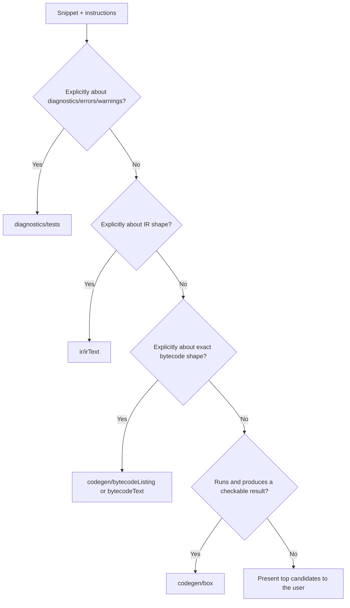

# kt-add-test

Turns a Kotlin snippet — or a bare `KT-XXXXX` YouTrack issue ID — into a correctly-placed,
correctly-annotated test file under `compiler/testData/` in whatever Kotlin monorepo checkout this
skill is invoked from. This is a **personal** skill: it never lives inside, and is never committed
to, any project repository. All paths it writes to are resolved **relative to the current project
root**, so it works identically from any worktree or clone.

Full reference tables (directives, directory map) live alongside this file:

- [`reference/directives.md`](reference/directives.md) — full directive catalog, syntax, source file, when-to-use.
- [`reference/directory-map.md`](reference/directory-map.md) — full test-type → `compiler/testData/...` mapping, topic subfolders, exclusions.

## Hard rules

1. **Never** place a test under `js/js.translator/testData/**`. That is Kotlin/JS-specific box/lineNumber/typescript-export
   infrastructure, entirely separate from the backend-agnostic `compiler/testData/codegen/box`. If the user asks for this
   location explicitly, refuse and redirect to the correct `compiler/testData/...` location instead — explain why.
2. **Never** run a Gradle command without explicit user confirmation obtained *after* the test file has been written. This
   includes `generateTests` and any targeted test run.
3. **Never** write anything inside the Kotlin repo checkout except the test-data file(s) the user asked for (and, after
   confirmation, whatever `generateTests` legitimately regenerates under `tests-gen/`).
4. **Never** guess when classification is genuinely ambiguous — present the top candidate categories with a short rationale
   and let the user pick.
5. All file paths this skill writes to must be **project-root-relative** (e.g. `compiler/testData/codegen/box/...`), never
   an absolute path baked in from a previous invocation.

## Step 1 — Parse input

Accept, in any combination:

- A Kotlin code snippet (a fenced code block, inline code, or attached file contents).
- Free-text instructions: desired category (`box`, `diagnostic`, `IR`, `bytecode`), a specific backend, "this is a bug
  repro" framing, a topic/subfolder hint, etc.
- An optional `KT-XXXXX` YouTrack issue ID (a plain ID, or a `https://youtrack.jetbrains.com/issue/KT-XXXXX` URL).

If a snippet is present, go straight to **Step 3**.

## Step 2 — Issue-ID-only mode (no snippet given)

If only a `KT-XXXXX` ID was supplied and no snippet:

1. Fetch the issue following the exact conventions in `.ai/guidelines.md` under "Working with YouTrack":
   - Use the YouTrack MCP if configured.
   - Otherwise use the `youtrack-cli` skill if configured.
   - Otherwise fall back to the YouTrack REST API:
     `https://youtrack.jetbrains.com/api/issues/KT-XXXXX?fields=summary,description,customFields(name,value(name,login,text))`.
   - Never fetch `youtrack.jetbrains.com` issue pages directly as a generic web page.
2. Read the issue's summary, description, and comments. Look for a fenced Kotlin code block, an attached `.kt`/`.java`
   file, or an inline snippet that reproduces the bug.
3. **If a repro can be derived:** extract the minimal snippet, note the issue's expected-vs-actual behavior (needed later
   to decide box vs. diagnostic classification and to know whether the test is *expected* to fail), and continue to
   Step 3 with that derived snippet. Always inject `// ISSUE: KT-XXXXX` later (see Step 6).
4. **If no repro can be derived** (the issue only describes behavior in prose, links an external project, or has no
   code at all): stop and ask the user to paste a snippet — do not fabricate one from a guess at the bug's cause.

## Step 3 — Classify the snippet

Decide what kind of test this should become. Use this decision tree (full directory table in
[`reference/directory-map.md`](reference/directory-map.md)):

Guidance per branch:

- **`diagnostics/tests`** — the snippet exists to show a diagnostic (error/warning) should or should not be reported;
  e.g. an ambiguous overload, a smart-cast that should/shouldn't apply, a wrong-annotation-target error. The test does not
  need a `box()` function.
- **`ir/irText`** — the ask is specifically about how the compiler lowers/represents a construct in IR, not about runtime
  behavior. Companion `.ir.txt` / `.kt.txt` files are **auto-generated by `generateTests`/the test run, never hand-written**.
- **`codegen/bytecodeListing` / `bytecodeText`** — rare; only when the ask is explicitly about exact bytecode instructions
  or class-file shape, not general runtime behavior.
- **`codegen/box`** (default for "does this code run/behave correctly") — the snippet is transformed to expose a
  `fun box(): String` that returns `"OK"` on success (see Step 4).

**JVM-only redirect rule:** if the snippet only makes sense on, or is only being tested on, the JVM backend (i.e. the only
`TARGET_BACKEND` that will be set is `JVM`/`JVM_IR`), it must NOT go in `codegen/box` — `PureJvmCodegenBoxTestChecker`
enforces this. Redirect it to `codegen/boxJvm` instead (or the matching single-backend sibling, e.g. `boxWasmJsInterop`,
for other backends).

**Ambiguity policy:** if the snippet could plausibly be more than one category (e.g. it both triggers a diagnostic and
would also run), present the 2–3 top candidates with a one-line rationale each and ask the user to pick, rather than
silently choosing one.

**Placement guard:** if the user explicitly asks for `js/js.translator/testData` (or another excluded location — see
[`reference/directory-map.md`](reference/directory-map.md) for the full exclusion list: `native/native.tests/**`,
`wasm/wasm.tests/**`, Analysis API tests, Gradle plugin tests), refuse that specific location, explain the correct
backend-agnostic equivalent, and use that instead.

## Step 4 — Pick the exact target subdirectory

1. Identify the topic (e.g. `smartcasts`, `callResolution`, `annotations`, `basics`, `generics`).
2. Search the chosen category's existing subfolders for a topic that matches (e.g.
   `compiler/testData/diagnostics/tests/<topic>/`, `compiler/testData/codegen/box/<topic>/`) — placing new tests near
   similar existing ones, per `compiler/fir/analysis-tests/AGENTS.md`'s convention, minimizes future maintenance.
3. If nothing fits, create a new topic subfolder that mirrors the naming style of sibling folders (lowerCamelCase).
4. Pick a descriptive, unique file name for the new test (lowerCamelCase, matching sibling files' naming style in that
   folder), e.g. `smartCastAfterElvis.kt`.

## Step 5 — Transform the snippet body

- **`codegen/box`/`boxJvm`:** wrap or adapt the snippet so it exposes `fun box(): String`. A standalone `fun main()` or a
  bare expression becomes the body of `box()`, ending with `return "OK"` on the success path (or returning a descriptive
  failure string that a human can grep for, per repo convention — never `throw`/`assert` as the sole check unless the
  original code already did that intentionally).
- **`diagnostics/tests`:** wrap the exact span of code expected to trigger (or not trigger) a diagnostic in
  `<!DIAGNOSTIC_NAME!>...<!>` markers. **Don't fully trust a guessed diagnostic name or marker span** — e.g. a bad
  initializer expression is reported as `INITIALIZER_TYPE_MISMATCH` on the `=` token, not a generic `TYPE_MISMATCH` on
  the expression; overload ambiguity may resolve differently than expected depending on the exact overload set. Treat
  Step 9's first test run as the source of truth: if it fails with "Actual data differs from file content," that's the
  framework telling you the real diagnostic name/span — adopt it (or use `-Pkotlin.test.update.test.data=true` once to
  have the framework fill in the correct markers, then review the diff before trusting it). If the
  test intentionally expects **zero** diagnostics, no markers are added. See
  [`reference/directives.md`](reference/directives.md) for the `RUN_PIPELINE_TILL` directive this interacts with.
- **`ir/irText`:** keep the snippet as plain runnable/compilable Kotlin; do not hand-write `.ir.txt`/`.kt.txt` — those are
  generated by the test run itself.
- **Multi-file / multi-module / Java interop:** split the snippet using `// FILE: Name.kt` markers for multiple files, or
  `// MODULE: name(deps)` + `// FILE: ...` for multi-module setups; use a `.java` file for Java interop pieces. See
  [`reference/directives.md`](reference/directives.md) for exact `FILE`/`MODULE` syntax.

## Step 6 — Infer and inject header directives

Infer directives from the snippet's actual APIs/imports and from any explicit instructions (backend, language version,
issue ID). Full catalog and syntax: [`reference/directives.md`](reference/directives.md). Quick signals:

| Signal | Directive |
|---|---|
| Uses stdlib (`listOf`, collections, `println`, etc.) | `// WITH_STDLIB` |
| Uses `kotlin.reflect`/`KClass`/`KType` | `// WITH_REFLECT` |
| Uses `suspend fun` / coroutine builders | `// WITH_COROUTINES` (+ `WITH_STDLIB` if real coroutine APIs are used) |
| Only reproducible on one backend | `// TARGET_BACKEND: <BACKEND>` |
| Reproducible everywhere but expected-broken on one backend | `// IGNORE_BACKEND: <BACKEND>` |
| Behind a language feature flag | `// LANGUAGE: +FeatureName` / `-FeatureName` |
| Behavior differs by API version | `// API_VERSION: X.Y` |
| Tied to a bug report (derived from Step 2, or user-supplied) | `// ISSUE: KT-XXXXX` |
| Diagnostics test, default | `// RUN_PIPELINE_TILL: BACKEND` — default to this even when diagnostics ARE expected; most individual diagnostics (e.g. an ambiguity or type-mismatch error on one expression) do not actually stop the rest of the file from reaching codegen, so `FRONTEND` is often rejected as "could be promoted to BACKEND." Only use `FRONTEND`/`FIR2IR` when the file genuinely cannot progress further (e.g. unresolved references, syntax errors) — verify by trying `BACKEND` first and downgrading only if the test run itself demands it. |

Write directives at the top of the file in this conventional order: `ISSUE`, `RUN_PIPELINE_TILL`, `LANGUAGE`/`API_VERSION`,
`WITH_STDLIB`/`WITH_REFLECT`/`WITH_COROUTINES`, `TARGET_BACKEND`/`IGNORE_BACKEND`.

## Step 7 — Write the file(s)

Write the file(s) at the path chosen in Step 4, **relative to the current project root** — never hardcode an absolute
path from a previous run, since this skill must work identically from any worktree/clone.

## Step 8 — Report and stop before touching Gradle

Report to the user, then **stop**:

- The chosen category and a one-line rationale (including why `codegen/box` vs `codegen/boxJvm` if relevant).
- The full list of injected directives and why each was added.
- The file path(s) written.
- A note if this is a "bug repro" test where a failing/red run is *expected* — not a skill failure.

Then explicitly ask: **"Run `generateTests` and the new test now?"** Do not run any Gradle command until the user
confirms.

## Step 9 — On confirmation: regenerate and run

1. Run `./gradlew generateTests -q` (quiet flag per `.ai/guidelines.md`/`.ai/testing.md` conventions).
2. Locate the generated test method:
   - `tests-gen/` output is written under a module's `build/` directory (e.g. `compiler/fir/fir2ir/build/tests-gen/...`)
     and is **git-ignored** — a repo-aware/git-grep-based search tool will not see it. Use a plain filesystem `grep`
     over the `build/tests-gen` tree instead.
   - Grep for the new file's **basename** (without extension) across all `*Generated.java` files under
     `**/build/tests-gen/`. The generated test method name is derived from the camelCase basename (e.g.
     `myNewTest.kt` → `testMyNewTest`).
   - **Disambiguate by `@TestDataPath`, not just by class/method name.** The same leaf folder name can exist under
     multiple parent categories (e.g. a `jdk/` topic folder can exist under both `codegen/box/jdk` *and*
     `codegen/boxJvm/jdk`, generating two similarly-named nested classes, e.g. `...Generated$Box$Jdk` vs.
     `...Generated$BoxJvm$Jdk`). Check the `@TestDataPath` annotation directly above the matching `@TestMetadata`
     method to confirm which nested class actually corresponds to the directory you wrote the file in, and use that
     exact nested-class chain in Step 9.3.
   - To find which Gradle module/task owns a given `compiler/testData/...` path (and thus which `test` task to run),
     check that module's `build.gradle.kts` for a `projectTests { testData(...) ; testGenerator(...) }` block listing
     that path — the module declaring it is the one whose `test` task compiles and runs the generated class.
3. Run just that single targeted test (not the whole suite) for a fast, resource-efficient check, e.g.:
   `./gradlew :compiler:fir:fir2ir:test --tests "org.jetbrains.kotlin.test.runners.codegen.SomeGenerated\$Outer\$Inner.testMethodName" -q`.

## Step 10 — Report the outcome

Distinguish clearly between:

- **Genuine pass** — reported as success.
- **Genuine unexpected failure** — reported as a real problem needing investigation.
- **Expected failure** — a red test that is a deliberate bug repro (from Step 2 or user framing): report as "reproduced
  as expected," not as a skill failure.
- **First-run `GENERATED_FIR_TAGS` auto-fill** — diagnostics tests get a `/* GENERATED_FIR_TAGS: ... */` footer appended
  automatically on their first run. This is expected tooling behavior, not an error; report it as such and note the file
  was updated.
