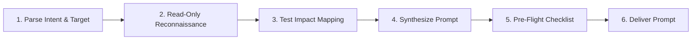

# create-prompt

Prepares a comprehensive, highly-structured, and repository-grounded prompt for another agent
(such as a planning agent, coding agent, subagent, or external model) or human developer.
This is a **personal** skill: it lives in `~/Pets/skills/prompting/create-prompt` and runs across
worktrees and repositories without ever committing to project codebases.

When users ask an agent to "prepare a prompt for another agent," agents commonly make two critical errors:
1. They misunderstand the goal and begin **implementing the task** or running builds/tests in the current session.
2. They enter a multi-step **plan mode** to plan their own execution rather than producing the prompt itself.
3. They produce vague, abstract prompts that lack the concrete file paths, symbols, and test impact analysis
   that make downstream agents effective.

`create-prompt` enforces a strict separation: **investigate read-only, assess test impact, ground everything in
concrete repo facts, and deliver only the ready-to-use prompt.**

Companion references alongside this file:
- [`reference/templates.md`](reference/templates.md) — modular templates for planning prompts, implementation prompts, bugfix prompts, and refactoring prompts.
- [`reference/checklist.md`](reference/checklist.md) — 10-point quality verification checklist before delivering the prompt.

---

## Hard Rules

1. **Never implement the underlying task in the current session.**
   All repository interactions must remain strictly **read-only** (searching code, reading files, inspecting git history, checking test suites). Do not edit source files, add tests, or modify project configurations.
2. **Never enter task-execution planning mode for yourself.**
   Do not trigger agent plan mode, delivery plans, or execution checklists to implement the requested feature. You are acting as the prompt designer and codebase researcher, not the implementer.
3. **Deep codebase grounding — zero hand-waving.**
   Every file path, class, interface, method, diagnostic name, CLI command, and Gradle task mentioned in the prompt must be verified against the actual repository. Never guess or approximate file locations.
4. **Mandatory Test Impact Assessment.**
   A high-quality prompt must anticipate what existing tests will break when the change is applied. You must actively search existing test suites (e.g. `testData`, unit tests, integration tests, box tests) to identify tests that will fail due to unexpected warnings, errors, or signature changes.
5. **Clean, uncluttered delivery.**
   Output the final prompt in a clean, self-contained format (either written to a standalone file like `prompt.md` if requested or implied, or wrapped in a single markdown code block). Do not prepend conversational filler ("Sure, here is your prompt:") or append meta-commentary recapping your research steps.

---

## Workflow



### Step 1 — Parse Intent & Target Recipient

Analyze the user's instructions to determine:
- **Target Recipient:**
  - *Planning Agent:* Needs architectural context, file breakdown, verification strategy, and open questions to resolve.
  - *Coding / Implementation Agent:* Needs exact file edits, function signatures, error handling, generator commands, and targeted test commands.
  - *Subagent / General Purpose:* Needs a self-contained brief with explicit scope boundaries and deliverables.
- **Task Category:** New compiler diagnostic, feature addition, bug reproduction/fix, API deprecation, or refactor.
- **Explicit Constraints:** Severity levels (e.g., `WARNING` vs `ERROR`), suppressibility requirements (`@Suppress`), positioning strategies, backward compatibility, performance constraints.
- **Output Mode:** Standalone file (e.g., `prompt.md` or a specified file path) vs. direct inline markdown block.

### Step 2 — Read-Only Codebase Reconnaissance

Explore the repository to uncover the concrete facts needed by the downstream agent:
1. **Find Existing Precedents / Analogues:**
   Search for similar features or diagnostics in the codebase. (e.g., if adding a suspend-function check, find how regular function checks are implemented; if adding a CLI flag, find existing flags).
2. **Locate Exact Integration Points:**
   Identify concrete relative file paths for:
   - Checkers / visitors / handlers (e.g., `FirJsInheritanceClassChecker.kt`).
   - Declaration and registration DSLs (e.g., `FirJsDiagnosticsList.kt`).
   - Message bundles and localization (e.g., `FirJsErrorsDefaultMessages.kt`).
   - Generators and build tasks (e.g., `:generateDiagnostics`, `:generateTests`).
3. **Verify API Types and Helper Methods:**
   Find exact method names and signatures (e.g., `ConeKotlinType.isSuspendFunctionTypeOrSubtype(session)`), positioning strategies (e.g., `DECLARATION_SIGNATURE_OR_DEFAULT`), and AST/FIR node types.

### Step 3 — Test Impact & Invalidation Mapping

A primary failure mode of automated code generation is unexpected test regressions. Investigate tests before writing the prompt:
1. **Search for Impacted Existing Tests:**
   Grep `testData` and test sources for patterns that the new logic will affect:
   - Tests that implement or call the newly restricted construct.
   - Diagnostic tests that assert on the exact list of emitted errors/warnings.
   - End-to-end / box / codegen tests that might fail compilation due to unexpected diagnostic errors or warnings.
   - Incremental compilation and cache invalidation test suites.
2. **Define Test Expectations:**
   Specify in the prompt:
   - Which existing test files are expected to fail and will need updated diagnostic markers (e.g., `<!WARNING!>...<!>`) or `@Suppress` annotations.
   - Which new test files must be created to validate the feature (positive cases, negative cases, edge cases, suppressibility).

### Step 4 — Synthesize the Prompt

Construct the prompt using the standard modular structure (see [`reference/templates.md`](reference/templates.md) for full examples):

```markdown
<Action-oriented Goal / Headline for downstream agent>

### Context & Requirements
- **Background**: Why this change is needed and how the system currently behaves.
- **Core Requirements**: Functional requirements, edge-case constraints, suppressibility, severities.
- **Specification**: Concrete naming conventions, diagnostic parameters, positioning strategies, default error/warning messages.

### Checker / Implementation Logic
- Exact components to modify with relative file paths.
- Step-by-step logic, condition checks, helper functions to use.
- Code generation or build tasks that must be executed (e.g. Gradle generator tasks).

### Test Impact & Verification
- **Existing Tests to Update**: Concrete paths to tests that will fail and how they should be handled (e.g. updating expected diagnostic output, adding suppressions).
- **New Tests to Add**: Concrete test scenarios covering positive cases, negative cases, edge cases, and `@Suppress` verification.
- **Test Commands**: Targeted test tasks and flags (e.g. `./gradlew ... --tests ...`).

### Key Reference Files
- Alphabetical or logical list of repository-relative paths to read first.
```

### Step 5 — Pre-Flight Checklist

Before presenting the prompt, evaluate it against [`reference/checklist.md`](reference/checklist.md):
- [ ] Are all file paths relative to the repository root and verified to exist?
- [ ] Are method names, class names, and diagnostic names verified against the codebase?
- [ ] Are affected existing test cases explicitly listed with relative paths?
- [ ] Is the prompt 100% self-contained (an agent reading it with zero knowledge of this conversation has everything needed)?
- [ ] Has all conversational filler, preamble, and meta-explanation been removed?

### Step 6 — Deliver the Deliverable

- **If a file was requested or implied (e.g., `prompt.md`):**
  Write the prompt directly to that file using project-relative paths. Provide a concise confirmation naming the file.
- **If outputting to chat:**
  Provide the prompt directly inside a single markdown code block (` ```markdown ... ``` `) without conversational pleasantries.
